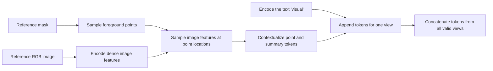

# How Multi-View Image Exemplar Tokens Are Built

This document explains how `build_exemplar_tokens_for_object()` turns masked CAD reference views into the exemplar-token sequence used to detect an object. The implementation is in [`finetune_image_exemplar_multi_gt.py`](../../finetune_image_exemplar_multi_gt.py#L1710).

The central idea is:

> The mask chooses **where to look**, while the reference image determines **what visual feature is found there**.

A sampled point and a reference image do not become two independent inputs in the final exemplar. The point is used to retrieve an appearance feature from the encoded reference image. Multiple points describe different foreground regions, and multiple views describe different appearances of the same object.

## End-to-end flow



For every requested reference view, [`build_exemplar_tokens_for_object()`](../../finetune_image_exemplar_multi_gt.py#L1710) loads a matching image and mask, samples foreground points, encodes the image, and constructs that view's tokens. Missing or unusable views are skipped. The tokens from all valid views are finally concatenated along the token dimension.

## 1. The mask selects foreground sample locations

[`sample_points_from_mask()`](../../finetune_image_exemplar_multi_gt.py#L786) places a golden-ratio/Fibonacci-style pattern inside the bounding rectangle of each mask contour. It discards candidates outside the mask and returns the remaining points as normalized `(x, y)` coordinates:

```python
[
    (0.42, 0.31),
    (0.51, 0.38),
    (0.35, 0.47),
    # ...
]
```

Here, `(0, 0)` is the image's top-left and `(1, 1)` is its bottom-right.

`num_points_approx` is only an approximate density control. The actual count can differ because candidates outside the mask are removed, and the pattern is applied separately to every valid external contour.

The mask is **not itself encoded as an exemplar token**. Its role is to identify image locations that belong to the object, preventing background locations from being used as the initial positive samples.

## 2. The reference image becomes a dense feature map

[`encode_detection_image_no_infer()`](../../finetune_image_exemplar_multi_gt.py#L996) preprocesses the complete reference image and runs it through the image encoder and SAM3 image projection:

```text
RGB reference image:  H x W x 3
Low-resolution map:   1 x C x H' x W'
```

Each `(H', W')` location contains a learned `C`-dimensional visual representation. In the default model, `C` is normally 256. These features encode properties such as local shape, edges, texture, and semantic context; they are not literal RGB samples.

## 3. Each point retrieves a visual feature

[`encode_exemplars_no_infer()`](../../finetune_image_exemplar_multi_gt.py#L1013) passes the normalized points and the low-resolution image feature map to the model's sampling encoder.

Inside [`PointSampleEncoder`](../../muggled_sam/v3_sam/components/sampling_encoder_components.py#L33), `_sample_image_tokens()` uses `torch.nn.functional.grid_sample` to bilinearly interpolate the encoded image map at every point. One point therefore initially produces one `C`-dimensional appearance vector:

```text
normalized point + encoded reference feature map
                         |
                         v
               local appearance token
```

A point on a handle and a point on a flat body surface can consequently produce different object-part features even though both came from the same reference view.

The call sets:

```python
include_coordinate_encodings=False
```

As implemented in [`PointSampleEncoder.forward()`](../../muggled_sam/v3_sam/components/sampling_encoder_components.py#L63), this means the point's absolute `(x, y)` encoding is not added to its initial token. The coordinates are still necessary to retrieve the corresponding image feature, but the token is not explicitly taught that the feature came from, for example, `(0.42, 0.31)`.

This is appropriate for cross-image exemplars: an object appearing on the left side of a reference rendering should still be detectable on the right side of a target image.

## 4. The sampling encoder contextualizes the tokens

The sampling encoder does more than return isolated local samples. In [`SamplingEncoder.forward()`](../../muggled_sam/v3_sam/sampling_encoder.py#L69), it:

1. adds a learned positive-coordinate label to every sampled foreground token;
2. appends one learned classification/summary token; and
3. runs a fusion transformer that lets these tokens attend to the complete encoded reference image.

After this transformer, a sampled token is best understood as:

```text
local appearance at a foreground point
+ learned indication that it is a positive sample
+ context gathered from the reference view
```

Thus, “one token per point” describes how the sequence is initialized, but the final point tokens are contextual object-appearance representations rather than isolated pixel descriptors.

## 5. The text `"visual"` is appended

For every valid view, the code calls:

```python
encode_exemplars_no_infer(
    detmodel,
    encimg_ref,
    text="visual",
    point_xy_norm_list=pts,
    include_coordinate_encodings=False,
)
```

The literal word `"visual"` is encoded by the model's [`SAMV3TextEncoder`](../../muggled_sam/v3_sam/text_encoder_model.py#L21). It normally yields multiple text tokens because the tokenizer includes boundary tokens as well as vocabulary pieces. These tokens are appended to the sampling tokens in [`encode_exemplars_no_infer()`](../../finetune_image_exemplar_multi_gt.py#L1038).

`"visual"` is a generic prompt, not the object ID or class name. The object-specific information primarily comes from the sampled reference-image features.

For a view containing `P_v` accepted points and `T` text tokens, the view contributes approximately:

```text
P_v point tokens + 1 sampling summary token + T text tokens
```

Its tensor shape is:

```text
[1, P_v + 1 + T, C]
```

## 6. Multiple views become one long token sequence

Each reference view is encoded independently and appended to `feats`. The final operation is:

```python
exemplar_ref = torch.cat(feats, dim=1).to(device)
```

This concatenates along dimension 1, the token dimension:

```text
[front-view tokens | side-view tokens | top-view tokens | ...]
```

The construction function does not average the views or explicitly fuse one view with another. It also does not add a separate view-ID token. Instead, downstream detection and segmentation transformers receive the combined sequence and can attend to whichever reference tokens best match the target image. See the exemplar input to [`ExemplarDetector.forward()`](../../muggled_sam/v3_sam/exemplar_detector_model.py#L92).

For valid views `v = 1 ... V`, the final shape is:

```text
[1, sum(P_v + 1 + T), C]
```

The point count may vary by view because mask shape affects how many candidate points survive.

## Concrete example

Suppose three reference views produce 18, 21, and 20 accepted foreground points, and the encoding of `"visual"` produces `T` text tokens. The final exemplar sequence is:

```text
view 1: 18 point tokens + 1 summary + T text tokens
view 2: 21 point tokens + 1 summary + T text tokens
view 3: 20 point tokens + 1 summary + T text tokens
```

Its total length is:

```text
18 + 21 + 20 + 3 * (1 + T) tokens
```

All of these tokens jointly describe the same object. The different points provide part-level appearance evidence; the different views provide viewpoint coverage.

## Summary

An exemplar token is not simply a point coordinate, image crop, or mask pixel. In this pipeline it is a learned feature vector built from an encoded reference image, initialized at a mask-selected foreground location, labeled as a positive sample, and contextualized against the rest of that reference view.

The complete object exemplar is a sequence containing:

- contextualized foreground appearance tokens from each reference view;
- one sampling summary token per view; and
- encoded `"visual"` text tokens repeated once per view.

The mask supplies foreground supervision, the image supplies appearance, and concatenating views supplies viewpoint diversity.
