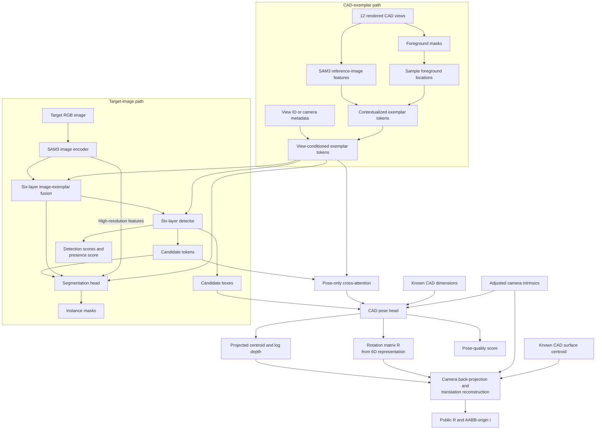
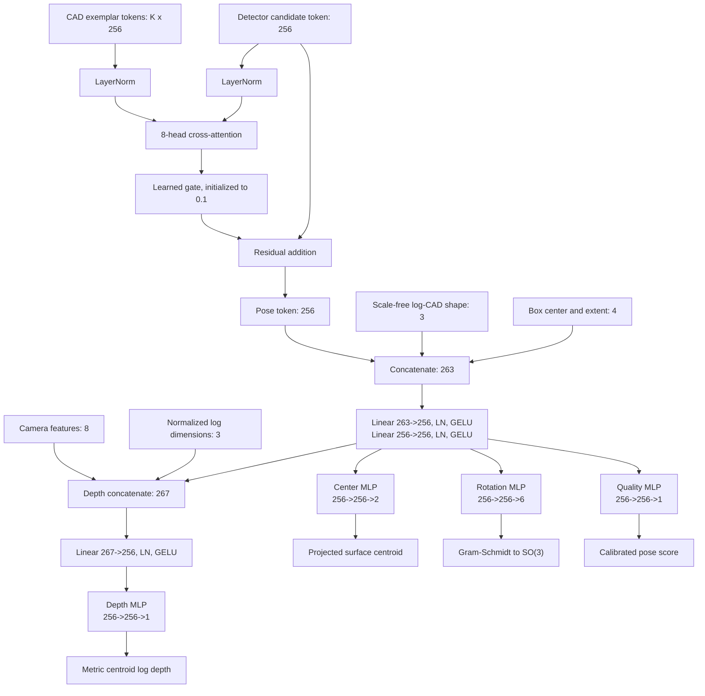
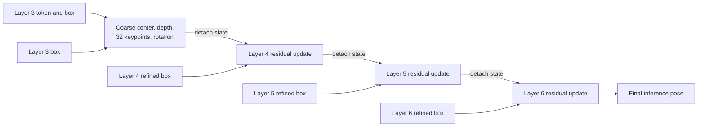

# CAD-Conditioned 6D Pose Estimation with SAM3

> Evidence snapshot: `main` at `748f8b1`, `codex/race-6d` at `8d79fa5`, and
> local run artifacts inspected on 2026-08-28.

## Executive summary

We extended exemplar-prompted SAM3 from instance segmentation to CAD-conditioned
6D pose estimation. The implemented system preserves SAM3's mask, box, and
detection outputs and adds a compact pose head to every detector candidate. It
uses the target RGB image, multi-view rendered CAD exemplars, known CAD geometry,
and calibrated camera intrinsics to predict a rotation and translation in the
camera frame.

The main design decisions are:

- represent translation internally by the projected **CAD surface centroid** and
  its metric depth, then reconstruct the public AABB-origin translation;
- predict rotation with a continuous 6D representation and supervise it using a
  label-free, symmetry-safe CAD surface point-set loss;
- keep absolute CAD dimensions and camera intrinsics confined to the depth path,
  while center and rotation use scale-free CAD shape features;
- let each detector query attend directly to the CAD exemplar tokens through a
  pose-only gated cross-attention adapter;
- use detector layers 3--5 for auxiliary pose supervision and layer 6 for the
  final prediction; and
- train the pose head together with a lightly adapted exemplar-fusion/detector
  path while retaining low-weight segmentation and detection anchors.

On the 5,000-scene Easy10 split, the strongest completed baseline reached
**24.23% all-match validation pose success** (epoch 86). Among predictions with
mask IoU at least 0.7, it reached **25.39% conditional pose success**, **94.81%
match coverage**, and **24.07% end-to-end pose success**. A later loss ablation
that disabled quality prediction and added a differentiable full-placement loss
improved the 50-frame memorization diagnostic from **63.53% to 83.53%**, but
reduced held-out 5k success from **24.23% to 22.00%**. The added loss therefore
improves capacity to fit the training examples but does not improve generalization
under the present data and schedule.

The `codex/race-6d` branch adds projected-keypoint and recurrent coarse-to-fine
pose heads over detector layers 3--6. These implementations are included below,
but there are no completed RACE-style run artifacts in this repository, so no
performance gain is claimed for them.

## 1. Problem formulation

For each detected instance, the required output is the rigid transform

$$
T_{\mathrm{cam}\leftarrow\mathrm{cad}}
=
\begin{bmatrix}
R & t\\
0 & 1
\end{bmatrix},
$$

where the canonical CAD frame is centered at the model's axis-aligned bounding
box (AABB), $R\in SO(3)$ is the object rotation, and $t\in\mathbb{R}^3$ is its
camera-space translation. The network does not regress $t$ directly. Let $\mu$
be the exact area-weighted surface centroid of the canonical CAD model and $s$
the known per-instance uniform scale. The camera-space centroid is

$$
c = R(s\mu)+t.
$$

The pose head predicts the normalized image projection $(u_c,v_c)$ and
$\log z_c$. Given the resize-adjusted camera matrix $K$, we recover

$$
\hat c=\exp(\widehat{\log z_c})K^{-1}
\begin{bmatrix}\hat u_c&\hat v_c&1\end{bmatrix}^{T},
\qquad
\hat t=\hat c-\hat R(s\mu).
$$

This representation is important for symmetric or off-origin CAD models:
geometrically equivalent poses share the same surface centroid even when their
AABB-origin translations differ.

## 2. Implemented architecture

### 2.1 End-to-end system



The exemplar masks determine where foreground features are sampled; the RGB
renders determine the feature values. Each valid view contributes contextualized
foreground tokens, a learned summary token, and tokens for the generic text
prompt `"visual"`. Tokens from all views are concatenated rather than averaged.
The completed Easy10 runs use 12 fixed views (`0`--`11`).

The `view_id` adapter adds a learned view-specific residual to every token from
the corresponding render. Internally it uses a 64-entry embedding table with a
128-dimensional hidden representation and a zero-initialized projection to the
256-dimensional token space. The alternative `camera` mode encodes the render
camera's forward and up directions in the CAD frame with three Fourier
frequencies and a `42 -> 128 -> 256` MLP. Both modes are exact no-ops at
initialization.

### 2.2 Pose-only CAD prompting and pose head



The pose-only cross-attention uses the detector candidate as query and the
padded multi-view exemplar sequence as keys and values. Its residual is sent
only to the pose head: the segmentation path continues to receive the original
detector token. Thus CAD prompting can specialize the pose representation
without directly mutating the token used by the mask decoder.

The shared input has 263 values:

- 256 values from the pose-adapted detector token;
- normalized box center and extent $(x_c,y_c,w,h)$; and
- three scale-free log-dimension values
  $\log d-\operatorname{mean}(\log d)$.

Two `Linear -> LayerNorm -> GELU` blocks produce a 256-dimensional shared
feature. Three task MLPs then predict a box-relative centroid residual (2), a
continuous 6D rotation (6), and a pose-quality logit (1). The projected centroid
is reconstructed as

$$
(\hat u_c,\hat v_c)=(x_c,y_c)+(\Delta u,\Delta v)\odot(w,h).
$$

The depth path adds three training-statistic-normalized metric log dimensions
and eight camera features: two log focal lengths, two principal-point values,
the two-dimensional ray through the candidate center, and the two-dimensional
angular box extent. A `267 -> 256` fusion layer and depth MLP predict one scalar
$\widehat{\log z_c}$. Restricting absolute scale and calibration to this path
prevents metric size from spuriously changing the predicted image center or
rotation.

The raw rotation output stores the first two columns of a rotation frame. A
Gram--Schmidt conversion produces a proper $3\times3$ rotation matrix, with
deterministic fallbacks for degenerate vectors. Pose confidence is kept separate
from detector confidence and is temperature-calibrated on validation data.

### 2.3 Deep supervision

SAM3 exposes stable candidate ordering across six detector layers. During
training, the same pose head is applied to layers 3, 4, and 5 in addition to the
final layer 6. The final one-to-one mask assignment is reused at every layer.
Only the layer-6 prediction is used at inference on `main`; the intermediate
predictions are training-time regularizers.

### 2.4 RACE-style extensions in `codex/race-6d` (not important for now)

Commit `8d79fa5` implements two opt-in extensions while preserving an exact
`off` path for the main architecture.

First, architecture v5 adds **32 projected CAD keypoints**: the eight AABB
corners and two trisection points on each of the 12 AABB edges. The keypoint
branch predicts box-relative image coordinates. It has three modes:

| Keypoint mode | Behavior |
| --- | --- |
| `off` | Exact architectural bypass. |
| `auxiliary` | Learn projected keypoints as an auxiliary task; rotation cannot consume them. |
| `conditioned` | Encode the predicted keypoints and add a zero-gated residual to the rotation feature. |

Second, architecture v6 adds **stateful coarse-to-fine refinement** over
detector layers 3--6:



Center and keypoint state remain box-relative so each stage follows the refined
detector box. A stage adds its predicted delta to the detached previous state.
Rotation deltas are mapped to $SO(3)$ and left-composed with the detached
previous rotation. Output branches are initialized to zero, except rotation
updates, which initialize to identity; migrating an older checkpoint therefore
starts with no learned correction.

The refinement ablation has four modes:

| Refinement mode | Depth update | Rotation update |
| --- | --- | --- |
| `off` | Original layer-6 scalar | Original layer-6 prediction |
| `scalar` | Additive log-depth residual | Residual $SO(3)$ composition |
| `distribution` | Cumulative 33-bin log-depth distribution | Residual $SO(3)$ composition |
| `full` | Cumulative 33-bin distribution | Residual rotation directly conditioned on detached keypoints |

The depth distribution represents log-depth ratios from `0.5x` to `2.0x`, with
bins concentrated near `1.0x`. Each stage accumulates logits and uses their
expectation as an offset from the coarse metric-depth anchor. In `full` mode,
keypoints form an explicit geometric bottleneck: rotation can consume them, but
the detach prevents rotation loss from turning the keypoint tensor into an
uninterpretable shortcut.

The branch also adds symmetry-equivalent keypoint target generation, OKS-style
and edge cross-ratio losses, per-stage correction diagnostics, checkpoint
correction-rate evaluation, and detailed per-instance pose-error plots. These
are implemented experiments, not validated improvements: no completed
`pose_refinement_mode != off` metrics are present in `runs/`.

## 3. Loss-function design

### 3.1 Assignment and IoU gate

Pose supervision uses deterministic greedy one-to-one assignment based only on
binary mask IoU. Each prediction and eligible ground-truth instance is used at
most once. Pose values are excluded from the matching cost so the pose head
cannot change which target supervises it.

The current joint-lite recipe applies pose loss only when the assigned mask IoU
is at least 0.5. Rejected pairs still receive the mask, box, and objectness
anchors. Evaluation reports an all-match row and an additional conditional row
at mask IoU $\ge 0.7$.

### 3.2 Pose losses

For a matched instance, the base pose loss is

$$
L_{pose}
=w_cL_{center}+w_zL_{depth}+w_RL_{rotation}
+w_PL_{placement}+w_qL_{quality}.
$$

The individual terms are:

**Projected-centroid loss.** Smooth-L1 between predicted and target normalized
image coordinates:

$$
L_{center}=\operatorname{SmoothL1}
\left((\hat u_c,\hat v_c),(u_c,v_c)\right).
$$

**Depth loss.** Smooth-L1 on standardized log depth:

$$
L_{depth}=\operatorname{SmoothL1}
\left(
\frac{\widehat{\log z_c}-m_z}{s_z},
\frac{\log z_c-m_z}{s_z}
\right).
$$

**Symmetry-safe rotation loss.** Each CAD has a deterministic dense surface
point set and a smaller query subset. Both are centered at the exact surface
centroid and scaled to the instance. Let $d$ be the effective AABB diagonal.
The one-sided nearest-neighbor loss is

$$
L_{rotation}=\frac{1}{|Q|}\sum_{q\in Q}
\rho_{0.01}\left(
\frac{\min_{p\in P}\|\hat Rq-R_{gt}p\|_2}{d}
\right),
$$

where $\rho_{0.01}$ is Smooth-L1 with `beta=0.01`. Nearest-neighbor matching
allows symmetry-equivalent surface placements to receive the same supervision
without manually labeling symmetry classes. Distances are computed in chunks
of 512 and promoted to float32 under bf16 training.

**Optional full-placement loss.** This applies the same normalized point-set
distance after adding the predicted and target camera-space centroids:

$$
L_{placement}=\frac{1}{|Q|}\sum_{q\in Q}
\rho_{0.01}\left(
\frac{\min_{p\in P}
\|\hat Rq+\hat c-(R_{gt}p+c_{gt})\|_2}{d}
\right).
$$

Unlike the disentangled rotation term, this loss couples rotation and
translation and directly optimizes full geometric placement.

**Pose-quality loss.** The original recipe constructs a detached soft target
from the normalized centroid error $e_c$ and mean full-placement surface error
$e_P$:

$$
q=\sigma\left(\frac{0.1-e_c}{0.02}\right)
  \sigma\left(\frac{0.1-e_P}{0.02}\right),
\qquad
L_{quality}=\operatorname{BCEWithLogits}(\hat q,q).
$$

This branch predicts whether both geometric errors meet the success criterion;
it does not provide gradients to the regression outputs because $q$ is detached.

The established 5k baseline uses

```text
w_center = w_depth = w_rotation = w_quality = 1
w_placement = 0
```

The later quality-off/full-placement ablation uses

```text
w_center = w_depth = w_rotation = 1
w_placement = 0.1
w_quality = 0
```

### 3.3 Detection anchors, final loss, and auxiliary loss

For joint-lite training, the detector anchor is

$$
L_{anchor}=0.10L_{mask}+0.25L_{box}+0.25L_{objectness},
\qquad
L_{mask}=2L_{BCE}+2L_{Dice}.
$$

The objectness helper internally weights matched and unmatched candidates by
0.3 and 0.45, respectively. The box loss is L1 on normalized boxes. Mask/box
training uses the detector's one-to-many assignment, whereas pose uses the
separate one-to-one assignment above.

With deep supervision on layers $\{3,4,5\}$, the per-image objective is

$$
L_{total}=L_{anchor}+L_{pose}^{(6)}
+0.5\operatorname{mean}_{\ell\in\{3,4,5\}}L_{pose}^{(\ell)}.
$$

Auxiliary layers always disable pose-quality BCE. They otherwise inherit the
geometric configuration, so the quality-off/full-placement experiment applies
the `0.1` full-placement term to both the final and auxiliary pose losses.

On `codex/race-6d`, projected-keypoint losses can additionally include
extent-normalized coordinate Smooth-L1 (`beta=0.05`), an OKS-style projected
area loss, and a cross-ratio loss over the 12 four-point AABB edges. The proposed
`full` launcher weights them by `0.25`, `1.0`, and `0.1`, respectively. A single
symmetry-equivalent target is selected by coordinate loss and reused for all
three terms.

## 4. Training protocol

### 4.1 Data and preprocessing

The main Easy10 experiment uses a 5,000-scene Perseve pose-v2 dataset split into
4,000 training, 500 validation, and 500 test scenes. The completed results below
are validation results; the test split was not used for checkpoint selection or
reported as a final evaluation. The validation split contains 752 pose-eligible
instances.

Each CAD point-set artifact contains a dense deterministic surface sample
(normally 4,096 points), a 512-point query subset, and the exact area-weighted
surface centroid. Images are resized to a maximum side length of 1008. The
intrinsic matrix is rescaled independently in $x$ and $y$ to match this raster.
Geometric crop augmentation is disabled because an unrecorded crop would
invalidate the camera model; color augmentation remains enabled for training.

### 4.2 Joint-lite optimization

The completed Easy10 runs use the following configuration:

| Item | Value |
| --- | --- |
| Precision / device | bf16 / one CUDA GPU |
| Batch size / gradient accumulation | 4 / 1 |
| Optimizer | AdamW, weight decay `1e-4` |
| Epochs | 100 for the full 5k runs; 500 for Overfit-50 |
| Pose and view-adapter learning rate | `5e-5` |
| Exemplar-fusion and detector learning rate | `3e-5` |
| CAD-prompt adapter learning rate | `1e-4` |
| Gradient clipping | global norm `1.0` |
| Reference views | 12, with `view_id` conditioning |
| CAD prompting | enabled, 8 attention heads |
| Deep supervision | detector layers 3, 4, 5; weight `0.5` |
| Pose train/evaluation IoU gates | `0.5` / `0.7` |
| Mask NMS IoU | `0.5` |
| Seed | 42 |

The image encoder, image projection, sampling encoder, text encoder, and
segmentation decoder are frozen. The exemplar-fusion module, six-layer detector,
pose head, view-ID adapter, and pose-only prompt adapter are trainable. Although
the segmentation decoder is frozen, it remains in the differentiable path, so
mask loss anchors the shared detector representation.

The 5k runs transfer the epoch-60 fixed-view `view_id` pose checkpoint into the
Easy10 dataset with a fresh optimizer, epoch counter, dataset provenance, and
dataset-derived normalization statistics. Validation runs before training and
after every epoch. Final temperature calibration is fitted only on validation
labels.

The Overfit-50 run deliberately validates on the same 50 training scenes (85
eligible instances) without training-time color augmentation. It is a
memorization/capacity diagnostic, not a generalization result.

## 5. Evaluation metrics

For pose-v2, raw angular rotation error is not the primary metric because a
symmetric CAD object can have several correct rotation matrices. We therefore
focus on:

- **normalized surface error:** mean nearest-neighbor distance between fully
  placed predicted and target surfaces, divided by the effective CAD diagonal;
- **centroid error:** Euclidean camera-space surface-centroid error in cm;
- **pose success:** both normalized centroid error and normalized surface error
  are at most 0.1;
- **conditional success:** success among one-to-one matches with mask IoU at
  least 0.7;
- **match coverage:** IoU-qualified matches divided by all pose-eligible ground
  truths; and
- **end-to-end success:** IoU-qualified successes divided by all eligible ground
  truths, equivalently `conditional success x match coverage`.

All-match pose success is useful for threshold-independent geometry comparison.
Conditional and end-to-end success must be reported together so a model cannot
appear better merely by excluding poorly localized examples.

## 6. Results

### 6.1 Reference-view conditioning

The first controlled 60-epoch ablation used the same corrected 12-view renders,
initialization, split, and seed for every arm. This was an earlier and harder ABC
validation set with 558 eligible instances, so its absolute values should not be
compared directly with Easy10.

| Exemplar view mode | Mean surface error | Centroid error | Match coverage | Conditional success | End-to-end success |
| --- | ---: | ---: | ---: | ---: | ---: |
| `none` | 0.7636 | 13.70 cm | 73.84% | 1.70% | 1.25% |
| `camera` | 0.7662 | 13.59 cm | 77.24% | 2.09% | 1.61% |
| `view_id` | **0.7552** | **13.54 cm** | **77.42%** | **3.24%** | **2.51%** |

Both view-aware modes improve localization coverage and end-to-end success. The
simple fixed-slot `view_id` encoding performs best overall, so these data support
view awareness but do not establish that the continuous camera encoding learned
generalizable camera geometry.

### 6.2 Easy10 5k baseline

The strongest baseline checkpoint occurs at epoch 86, while the final calibrated
row is epoch 100.

| Checkpoint | All-match pose success | Conditional success | Match coverage | End-to-end success | Conditional surface error | Conditional centroid error |
| --- | ---: | ---: | ---: | ---: | ---: | ---: |
| Epoch 86, selected by pose | **24.23%** | **25.39%** | 94.81% | **24.07%** | 0.1283 | 4.70 cm |
| Epoch 100, calibrated | 22.77% | 23.88% | 94.68% | 22.61% | **0.1262** | **4.59 cm** |

The final checkpoint has slightly lower mean geometric errors, but fewer
instances fall jointly below both 0.1 success thresholds. This is why checkpoint
selection should use the task metric rather than total training loss or one mean
error alone. Segmentation mean IoU remains stable (`0.8371` at epoch 86 and
`0.8377` at epoch 100), so the pose-selected checkpoint does not trade away mask
quality.

### 6.3 Quality-off/full-placement ablation

The loss ablation keeps the same dataset, transfer checkpoint, seed, optimizer,
100-epoch schedule, prompting, and deep supervision. Its only intended loss
changes are `w_quality: 1 -> 0` and `w_placement: 0 -> 0.1`.

| 5k validation recipe | Best epoch | All-match pose success | Conditional success | Match coverage | End-to-end success | Conditional surface error | Conditional centroid error |
| --- | ---: | ---: | ---: | ---: | ---: | ---: | ---: |
| Quality on, placement off | 86 | **24.23%** | **25.39%** | **94.81%** | **24.07%** | **0.1283** | 4.70 cm |
| Quality off, placement `0.1` | 97 | 22.00% | 22.89% | 92.95% | 21.28% | 0.1304 | **4.63 cm** |

The new loss slightly improves conditional centroid error but worsens surface
error, match coverage, and all success rates. Its final calibrated all-match
success is 20.13%, versus 22.77% for the baseline. Segmentation mean IoU at the
selected epoch also falls from 0.8371 to 0.8239.

The same comparison on the 50-scene memorization diagnostic gives the opposite
result:

| Overfit-50 recipe | Best all-match success | Final calibrated success | Final surface error | Final centroid error |
| --- | ---: | ---: | ---: | ---: |
| Quality on, placement off | 63.53% | 63.53% | 0.0701 | 2.73 cm |
| Quality off, placement `0.1` | **83.53%** | **81.18%** | **0.0549** | **1.83 cm** |

The full-placement term clearly makes the architecture better able to fit a
small training set. Because that gain does not transfer to held-out 5k
validation, the present bottleneck is not simply insufficient pose-head capacity.
The likely issues are regularization, data diversity, optimization, or the
coupling introduced by full-placement gradients. Increasing its weight without
a matched validation improvement is not justified.

An additional quality-off run with `w_placement=0` is still incomplete (61 of
300 planned epochs at the time of this report) and is excluded from the
conclusion.

### 6.4 Status of RACE-style refinements

The projected-keypoint and coarse-to-fine paths exist only in
`codex/race-6d` at commit `8d79fa5`. The branch supplies ablation launchers and
diagnostic metrics, but the repository contains no completed `scalar`,
`distribution`, or `full` run. Consequently, the report can conclude that the
architecture was implemented with accompanying unit tests, but not whether it
improves pose.
The fair next comparison is `off` versus `full` with identical initialization,
100-epoch budget, split, seed, and joint-lite optimizer, followed by multiple
seeds if the effect is small.

## 7. Conclusions

The project now has a coherent CAD-conditioned 6D pose pipeline rather than a
direct XYZ/Euler regression add-on. Its strongest aspects are the centroid-based
translation representation, symmetry-safe point-set supervision, explicit
separation of scale-free rotation features from metric depth features, and
pose-only access to multi-view CAD tokens. The ground-truth-as-prediction tests
confirm that center, depth, rotation, translation reconstruction, and joint
detection losses reach their expected minima.

Empirically, pose learning has progressed from roughly 1--3% success on the
initial broad ABC experiments to 24.23% all-match validation success on Easy10.
View-ID conditioning, direct CAD prompting, deep supervision, and the easier
target distribution all contribute to the current system, although the combined
experiments do not isolate every contribution.

The latest loss experiment provides a useful negative result: direct
full-placement supervision is powerful enough to improve memorization by 20
percentage points, but it currently reduces held-out success by 2.23 points.
The baseline quality-on/disentangled loss should therefore remain the default
for generalization until a regularized or staged full-placement recipe wins on
validation.

Finally, the RACE-style branch is a credible next architectural test because it
makes layers 3--6 inference-critical and introduces an interpretable projected
geometry bottleneck. It should not yet be described as an improvement. Its value
must be decided by a matched ablation using symmetry-safe rotation surface error,
full-placement surface error, centroid/depth error, IoU-qualified coverage, and
end-to-end pose success.

## Implementation references

- Main pose head: [`muggled_sam/v3_sam/cad_pose/head.py`](../../muggled_sam/v3_sam/cad_pose/head.py)
- Pose losses: [`muggled_sam/v3_sam/cad_pose/losses.py`](../../muggled_sam/v3_sam/cad_pose/losses.py)
- Training and evaluation: [`finetune_image_exemplar_multi_gt.py`](../../finetune_image_exemplar_multi_gt.py)
- Exemplar view adapter: [`muggled_sam/v3_sam/exemplar_view_pose.py`](../../muggled_sam/v3_sam/exemplar_view_pose.py)
- Pose implementation guide: [CAD pose head implementation](../cad-pose-head-implementation.md)
- Matching and metrics: [CAD pose matching and evaluation](../cad-pose-matching-and-evaluation.md)
- Main result records: [recent pose experiments](../experiments/2026-08-05-recent-pose-experiments-conclusion.md) and [quality-off/full-set note](../experiments/one-big-note.md)
- Branch-only RACE documentation: `codex/race-6d:docs/race-keypoint-experiment.md` and `codex/race-6d:docs/race-coarse-to-fine-experiment.md`
